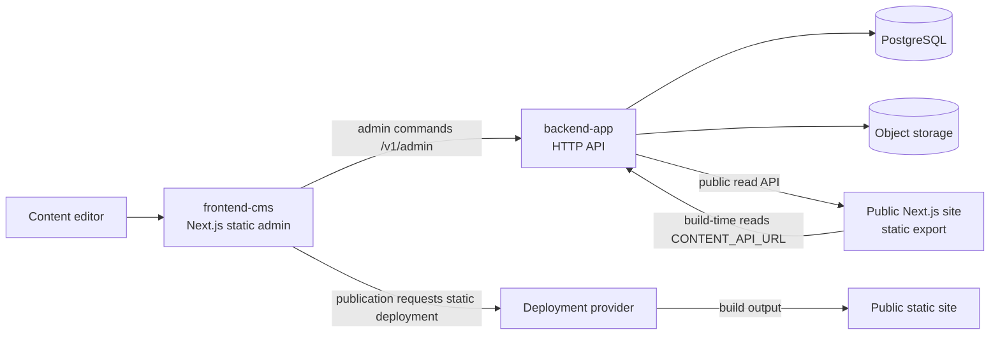

# BIZON architecture audit — 2026-10-07

## Scope and evidence boundary

This audit covers the public Next.js website at the repository root, the `frontend-cms` administrative application, and the `backend-app` API. It combines source inspection, repository state, unit tests, production-style builds, and read-only checks against the currently available local API. It does not establish production deployment state or prove a complete CMS edit-to-public-site transaction.

The code checkout is split into three Git repositories. At audit start, the root repository was on `main-app` at `0c12b7b`, the backend on `backend-app` at `64395fa`, and CMS on `frontend-cms-push` at `63f655a`. Existing untracked assets and audit material were preserved. No commits, migrations, database writes, or deployments were made.

## RESEARCH

### System map

### Component responsibilities and interfaces

| Component | Responsibility | Main boundary |
|---|---|---|
| Root Next.js application | Public catalog, pages, articles, forms and storefront experience | Reads published API content at static-build time; exports static output |
| `frontend-cms` | Content and catalog administration | Calls backend's generic admin command endpoint; triggers deployment after publication |
| `backend-app` | Auth, admin commands, publication state, public read endpoints and media operations | PostgreSQL plus object storage; exposes `/v1/admin/*` and public `/v1/*` routes |
| PostgreSQL | Draft/published operational content and application data | Schema readiness depends on migrations and a pre-existing core schema |
| Static deployment provider | Builds and serves the public export | CMS receives a start/failure-style result, not proof of the deployed revision |

### Findings discovered during research

1. **The three apps are separate repositories with separate release/build contracts.** A root deployment workflow does not validate or release the backend or CMS. Each component needs its own artifact and environment configuration.
2. **The public website is statically exported.** Content is read during the build. A successful backend publication does not immediately change already-generated pages; a deployment must build from the intended API state.
3. **The publication-to-deployment boundary does not confirm freshness.** CMS can learn that a deploy was started, but there is no observed end-to-end revision acknowledgement proving the public site contains that change.
4. **Backend CORS configuration was too broad across route classes.** A single origins list could permit the public site's origin to make browser requests to admin routes. This was fixed in this audit by separating admin and public origin policies.
5. **Lead-request throttling used a process-local map without a key-count bound.** High-cardinality client addresses could grow memory use. A bounded limiter was added; it remains process-local and therefore is not a distributed quota.
6. **The repository's CI could not reliably build the static site without live content API configuration/data.** A deterministic in-memory fixture build was added for CI. This validates route generation and build contracts, not production content quality or availability.
7. **A fresh empty PostgreSQL database is not provisioned with the complete core schema by the checked-in migration chain.** Migrations are additive and include alterations to existing tables. The compose database alone is not a complete fresh-install path.
8. **Admin command contracts are duplicated.** CMS and backend maintain overlapping method/argument/error contracts without a shared generated schema or runtime-validated API definition.
9. **Public read paths perform repeated relation lookups.** Tire type/model and shop product reads include per-parent relation queries. This is an N+1 pattern; production impact needs query/latency evidence before optimization.
10. **Editor feature coverage is uneven.** CMS has a materials article workflow; no equivalent story editor/API workflow was found in the inspected code.

## UNDERSTANDING

### End-to-end content lifecycle

1. An editor changes content in CMS. CMS calls the backend admin command interface.
2. Backend validates authorization and persists draft/working state in PostgreSQL; media may also involve object storage.
3. A publication command promotes the selected content. The pack publication helper uses a transaction so its database writes are atomic within that operation.
4. CMS requests a static-site deployment. The current response describes whether the deployment was started/configured/failed; it does not identify a completed build revision.
5. Root Next.js reads public API endpoints during static generation and exports pages. The public page changes only after a successful build and deployment.

This means there are two distinct states: **published in the backend** and **visible on the deployed static site**. The current interface does not provide a strong consistency signal between them.

### Main coupling and failure propagation

- CMS and backend are coupled by a generic command dispatcher. The flexibility reduces endpoint count but makes method names, argument shapes, authorization rules, and error unions easy to drift.
- Public site and backend are coupled at build time through `CONTENT_API_URL`; the site build is not an independent frontend compile when dynamic data-backed routes are enumerated.
- CMS and static deployment are coupled through deployment credentials/configuration. A deploy request is an asynchronous operation and can outlive the CMS request.
- Backend and PostgreSQL are coupled through an existing core schema plus incremental migrations. Migration success alone does not prove a blank database is bootable.
- Rate limits currently live in each backend process. Horizontal scaling gives each instance its own counters and restart resets them.

### Runtime evidence

At audit time, local backend readiness returned HTTP 200. Sample public endpoints returned HTTP 200 for tire types, wheel types, shop categories/products, articles, and the home page. These point-in-time local checks prove those routes answered in the inspected environment. They do not prove production health, persisted CMS edits, object storage access, or public deployment freshness.

## PLAN DEVELOPMENT

Priority is based on data integrity, security exposure, release reliability, and operational diagnosability.

| Priority | Problem | Impact | Recommended next action |
|---|---|---|---|
| P1 | No reproducible fresh-database bootstrap for the core schema | New environment recovery and onboarding can fail before app startup | Define and document a canonical baseline schema/bootstrap, then prove empty-DB migration and readiness in an isolated database |
| P1 | Publication and static deployment have no revision-level completion proof | Editors can see “started” while the public site remains stale or the build fails later | Persist a publication/deploy operation ID and source revision; expose build completion and deployed revision back to CMS |
| P1 | Production CORS admin origin must be explicitly configured after the route-scoping change | Missing configuration blocks CMS browser access; an incorrect origin can expose admin routes to another site | Set exact production CMS origins in backend deployment configuration and verify preflight plus authenticated admin requests |
| P1 | Three independently versioned repositories have no demonstrated cross-repo release compatibility gate | A backend/CMS/site change can be released against incompatible contracts | Add a versioned API contract and a small integration gate covering the supported release combination |
| P2 | CMS/backend admin contracts are duplicated and dynamically dispatched | Contract drift can create runtime failures despite independent typechecks | Define shared OpenAPI/JSON Schema or a versioned generated client; validate inputs and outputs at runtime |
| P2 | Public read models contain N+1 relation reads | Catalog latency and database load may increase as data grows | Capture query counts/latencies on representative data, then batch relations and add measured indexes |
| P2 | Request limiter is local to a process | Limits vary across instances and reset on restart | Use a shared store only if deployment topology requires consistent global limits; retain the local cap as fallback |
| P2 | No story workflow found alongside materials articles | Content operators may rely on manual edits or an undocumented path | Confirm whether stories are an active product requirement; if so, define and implement the full editor/API/public contract |
| P2 | Deployment-trigger result is not completion/freshness evidence | Difficult to distinguish API publication from public propagation | Add operation status polling/webhook and display the deployed revision/time |

### Implementation selected for this run

This run addressed directly supportable code/CI issues without modifying data or external environments:

- scope CORS origins by public versus admin route;
- bound process-local request limiter memory;
- make the static root build reproducible in CI using an in-memory API fixture;
- correct local dev ports and required build environment documentation;
- align CMS error/deployment response types with backend responses;
- add this audit as a durable record.

Database bootstrap, API contract generation, N+1 optimization, distributed throttling, deploy revision tracking, and story workflow need broader product or operational decisions and remain planned findings.

## IMPLEMENT

### Changes made

| Area | Change | Verification |
|---|---|---|
| Backend CORS | Separate `CMS_ALLOWED_ORIGINS` for `/v1/admin*` from `CORS_ALLOWED_ORIGINS` for public routes; production fails closed when the relevant list is absent | Route-scoped tests; full backend suite |
| Backend rate limiting | Add `createRateLimiter` with a configurable tracked-key cap and expiry pruning | Targeted limiter tests; full backend suite |
| Public-site CI | Add `npm run build:ci`, which starts an ephemeral local fixture API and supplies build URLs without production content | Full static export with representative dynamic routes |
| Local development | Root public site uses port 3000; CMS uses port 3001, matching documented topology | Package/workflow inspection and successful builds |
| CMS contract typing | Align deployment status and admin error variants with backend responses | CMS typecheck/build and test suite |
| Documentation | Rewrite component READMEs with real ports, environment boundaries, static build behavior, and migration caveat | Source review |

### Checks run

- Root tests: **140 passed**.
- CMS tests: **90 passed**.
- Backend tests: **185 passed**.
- Backend typecheck: passed.
- Root `build:ci`: passed; generated and exported 28 static pages using fixture content.
- CMS production build: passed with `NEXT_PUBLIC_ADMIN_API_URL` supplied; exported 21 static pages. Lint reported warnings, no build failure.
- Root and CMS lint checks passed with existing warnings (13 and 17 respectively).
- Local backend readiness and sampled public GET endpoints returned HTTP 200.

### Remaining proof gaps

- No production or staging configuration was inspected or changed.
- No database migration or write was performed. Empty-database bootstrap remains unproven and is a P1.
- No browser-driven authenticated CMS edit → database reread → publication → deploy completion → public page reread was performed.
- The fixture CI build cannot validate production API data, credentials, storage, or deployment behavior.
- No performance measurements were collected, so N+1 impact is a risk pattern rather than a quantified production defect.
- Changes are uncommitted across the three repositories; baseline untracked files and assets remain preserved.
